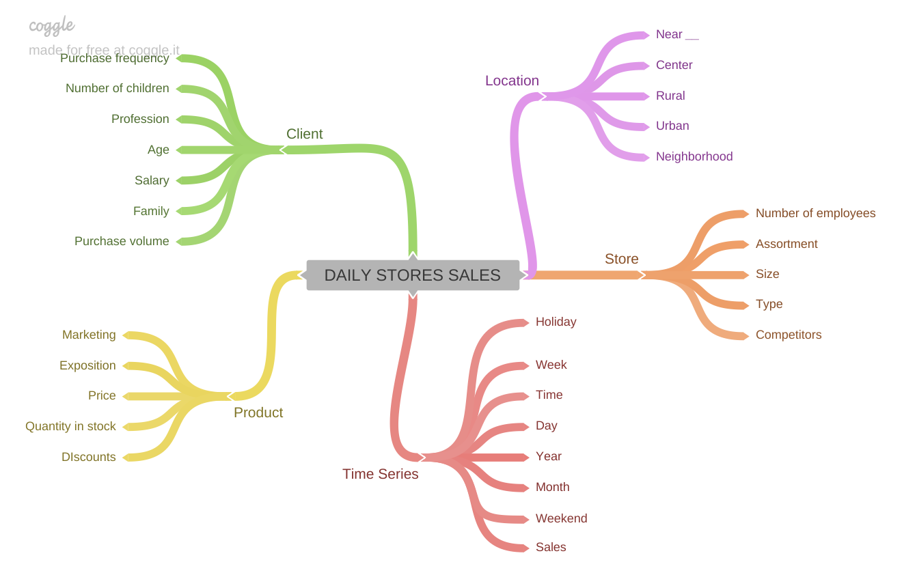

# Rossmann-Store-Sales

Drugstore Sales Forecast with Machine Learning.

*(This README is under construction :D)*

*This Data Science project presents a sales prediction for one of the largest drugstore chains in Europe, called Rossmann. It is a German company with more than 3,000 stores located across seven European countries. The project was inspired in a database available from a [Kaggle competition](https://www.kaggle.com/c/rossmann-store-sales/overview).*

Data Science is an extremely diverse field: it envolves programming, mathematics and statistics, data analysis and visualization, machine learning... 
Each subject needs to be studied deeply and individually, although in practise they are strongly related in a step-by-step resolution.

Developing an end-to-end project is an opportunity to apply skills from the different existent branches of DS, from business understanding and data description to model deployment. This led me to work carefully on each step of this project for having a broad and extensive understanding on each of the steps followed through coding.

Here is what I will cover:

- 1.[ Business Problem](#business-problem)
- 2.[ Data Description](#data-description)
- 3.[ Exploratory Data Analysis](#exploratory-data-analysis)
- 4.[ Machine Learning Modelling](#machine-learning-modelling)
- 5.[ Conclusion](#conclusion)
- [Special Thanks](special-thanks)
- [References](#references)

Moreover, you can check the (so far) final version of the Jupyter Notebook coding [here](v10-Rossmann_Store_Sales.ipynb), as well as the slide presentation created for Business Storytelling [here](Project_Storytelling.pdf).

## Business Problem

Imagine you receive a specific task from your boss telling you the exact results that the company needs for the moment. You spend valuable working hours trying to develop the most fittable solution and acquire accurate results, and when you are finally ready to present them to your superiors it turns out that those results are not enough for giving the company the best insights in order to solve their main issues.

This is where business understanding goes in. Before starting any data science project, understanding the reason why this project is going to be developed in the first place is indispensable, not only for arriving into the best solution but also for checking if all the data needed for your project is available or can be accessed.

For this project, in order to motivate the development of the challenge's solution, a fictional situation was created. The business problem is:

- The sales forecast was requested by the CFO at a monthly meeting on store results;
  - Root cause: difficulty in determining the investment value for the renovations of each store.

Therefore, **each store daily sales for the upcoming six weeks** are going to be predicted, giving the CFO a better understanding of the individual incomes on the next days and allowing him to invest according to the profit of the stores.

### General overview of the problem

- Granularity: forecast sales per day, per store, for the next 42 days (6 weeks)
- Problem Type: sales forecast
- Potential ML Methods: Time Series, Regression
- Delivery Format: the total sales value of each store at the end of 6 weeks

## Data Description

The used data consists of specific information regarding sales data for 1,115 Rossmann stores, acquired between **2013-01-01** and **2015-07-31**. The features included are:
- Date
  - Date of sales, holidays
- Store
  - Type, assortment
- Costumer
  - Quantity
- Competition
  - Distance, open since
- Promotion
  - Period of promo, if there was a consecutive promo  

Since they don't bring any sales information, closed stores or stores without revenues were excluded from the model.

### Feature Engineering

It is a hard task to find the best way to work with your data, but it normally starts with highlighting relevant information and removing noise. Besides, feature engineering process is very objective: consists of turning raw data into a numeric table without missing values.

 - **Missing Values:** as many machine learning algorithms do not support missing values, when facing missing values there are three main options for fillout them:
    - Delete them by **erasing rows with missing values**, which is a quick and simple method but may remove relevant data for other features;
    - Use ML algorithms that are able **replace empty columns with the column's own behavior** (such as median, average, prediction of behavior for not NA rows); or
    - Understanding the business and **imputing the NAs with coherent values**, which means *"why is this NA here? It may be a business logic that, when understood, will allow you to replace these NAs with values in some way?"*. 

- **Business Case Hypothesis**:

- **Variable filtering**: 
- **Rescaling**: 
- **Transformation**:
  - Response variable transformation: 
  - Encoding: 
  - Nature transformation: 

## Exploratory Data Analysis

univariate, bivariate, and multivariate analyses were conducted. We validated the hypothesis list built previously in the bivariate analysis: 
(TABLE)

## Machine Learning Modelling

For working on Machine Learning algorithms, the projects data was into training and validation sets:

- Training data corresponds to all data entries between 2013-01-01 to 2015-06-19
- Validation data contains entries from the last 6 weeks of available data, 2015-06-19 to 2015-07-31
- Test data corresponds to data entries between 2015-07-31 to 2015-09-16. This data doesn't have the target variable sales and will be used as the input to generate predictions in production;

- Regression
- Time Series

## Conclusion

From retrieving and cleaning the company's data, conducting descriptive statistics analysis, modeling the machine learning algorithms for regression, to grasp the main ideas behind deployment and production environment settings, this project was challenging in many ways.

For checking the outcomes, please dive into the slide presentation created for Business Storytelling [here](Project_Storytelling.pdf).

## Special Thanks

I would like to give a special thanks to Meigarom Lopes for providing the orientation needed for me to achieve these results, as well as for improving my Data Science knowledge throughout the course Data Science in Production. For more details, please check his course (in Portuguese) [here](https://sejaumdatascientist.com/como-ser-um-data-scientist/).

## References
